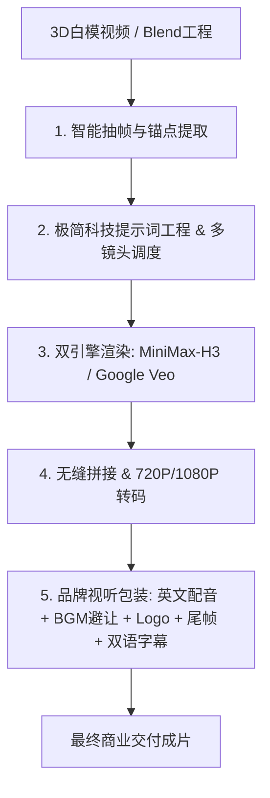

# 国庆视频 · 3D 白模生成商业科技宣传片全流程技能 (Guoqing Video Skill)

本技能提供了一套完整的工业级 AI 视频生产工作流，能够将未经着色的 **3D 白模视频 / CAD 运动骨架** 一键转化为具备 **Apple 发布会质感、极简工业光影、双镜头叙事、商业级人物配音、品牌包装与双语字幕** 的高清商用短片。

---

## 核心流程五部曲 (The 5-Step Pipeline)



### 步骤一：白模解析与关键帧锚点提取
* **运行脚本**：`python3 scripts/01_extract_anchors.py --input <raw_video.mp4>`
* **产出**：
  * `@1`: 整机全景亮相帧（Hero Anchor）
  * `@2`: 核心部件解构/爆炸特写帧（Exploded Anchor）
  * `@3`: 组装回位/连续运转帧（Operation Anchor）

### 步骤二：多镜头渲染（Dual-Shot Rendering）
* **运行脚本**：`python3 scripts/02_render_shots.py`
* **镜头设计**：
  * **Shot 1 (0~15s：机械解构与爆炸特写)**：气缸螺栓、法兰与内部活塞沿轴线平滑展开，展现内部精密机械结构。
  * **Shot 2 (15~30s：重构回位与平稳运转)**：散落部件精准回位紧固锁死，大型配重飞轮启动连续旋转，驱动活塞持续往复运动。
* **支持渲染引擎**：
  * `MiniMax-H3`（国内高可用，支持多图锚点与物理微动原生音效，分辨率 768P/2K）
  * `Google Veo 3.1`（Google 原生旗舰视频大模型，支持首尾帧控制与 4K 生成）

### 步骤三：双镜头无缝拼接 (Shot Splicing)
* **运行脚本**：`python3 scripts/03_splice_shots.py`
* **功能**：自动将 Shot 1 与 Shot 2 进行无缝级联，规格化为标准 16:9 横屏，画质可按需输出 720P 或 1080P。

### 步骤四：专业英文商业人物配音 (Neural Voiceover)
* **运行脚本**：`python3 scripts/04_generate_voiceover.py`
* **技术**：基于 `edge-tts` 的顶级商业旁白音色（如 `en-US-ChristopherNeural`），按 30 秒分镜时间轴精准打点生成分段语音。

### 步骤五：视听综合包装与双语字幕压制 (Full Mastering & Subtitles)
* **运行脚本**：`python3 scripts/05_final_synthesis.py`
* **运行脚本**：`python3 scripts/06_burn_subtitles.py`
* **功能**：
  1. **左上角品牌 Logo**：透明 PNG 悬浮叠加，保持优雅边距；
  2. **片尾结束帧海报**：在第 26 秒平滑淡入收尾；
  3. **背景音乐与智能避让 (Audio Ducking)**：混入商业级高能量 BGM（如《Best Friend》），人声说话时音乐自动压低，间奏时节奏增强；
  4. **双语高品质字幕**：采用冬青黑体（`Hiragino Sans GB` W6），中英双层居中排版，柔和描边与阴影，无损硬字幕压制。

---

## 常用命令速查

```bash
# 一键运行全自动流程
python3 scripts/run_full_pipeline.py --video input_raw.mp4 --logo logo.png --outro outro.jpg
```
